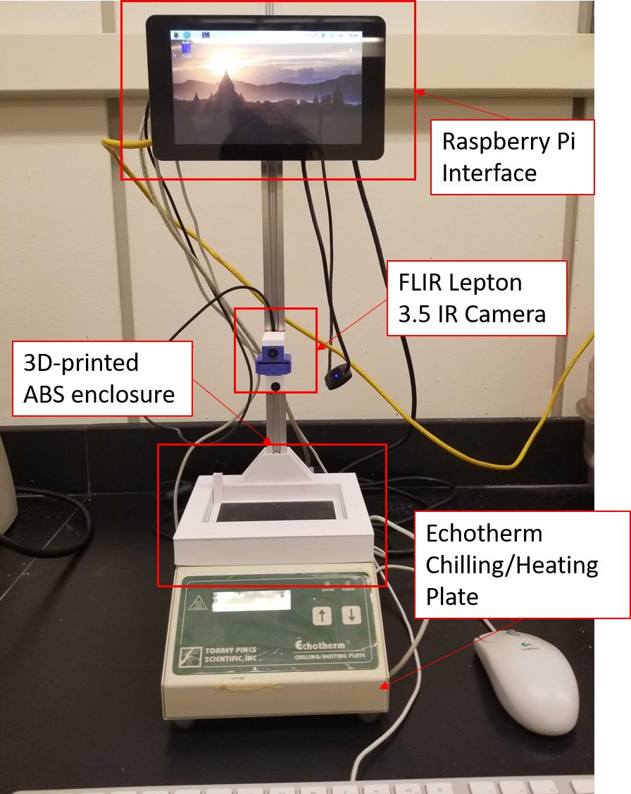
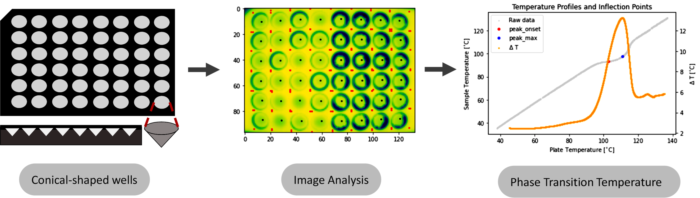
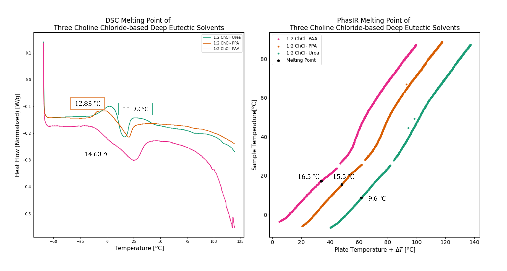
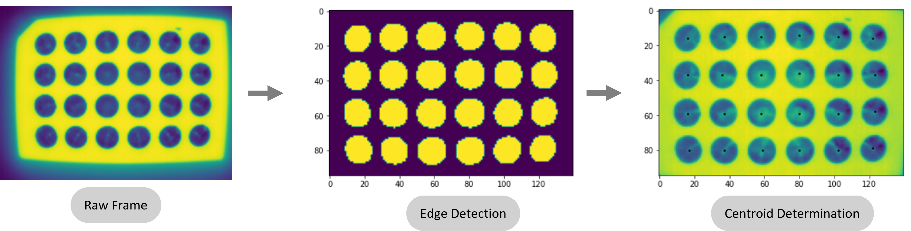
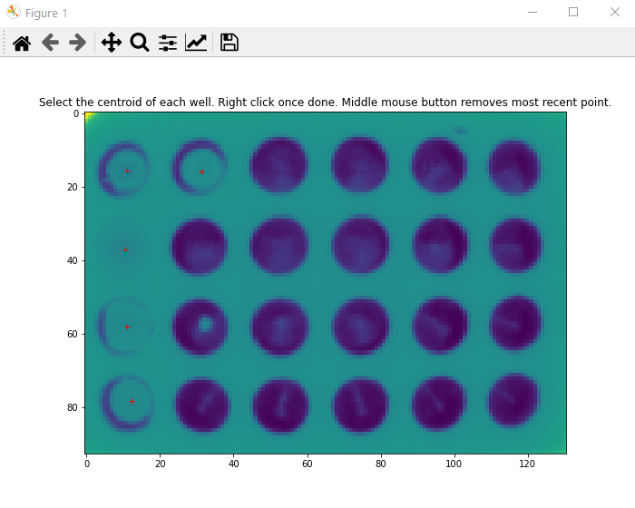
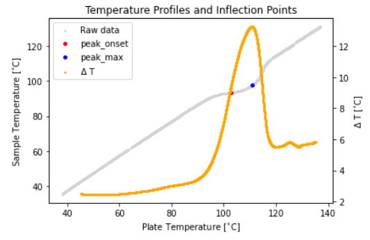

# PhasIR

Python modules for high-throughput thermal analysis for fast and accurate estimation of phase transition temperatures for up to 96-samples analyzed simultaneously in under 15 minutes. The package includes the data analysis software, as well as build files to reproduce the PhasIR hardware infrastructure.

## The Hardware System

The hardware PhasIR system is composed of a **FLIR Lepton 3.5 IR camera** placed above a **Echotherm IC25 Chilling/Heating plate** and a **Raspberry Pi Interface**.

To ensure a constant sample position in the well across the entire temperature transition, the aluminum wellplate was designed with _conical-shaped wells_. The plate surface was also painted black to ensure an emissivity of one and improve the data collection.

The overall design of the PhasIR hardware system takes inspiration from Differential Thermal Analysis (DTA) techniques that operated on a single sample at a time. A black anodized aluminum plate is used as the reference point for the plate temperature, while the sample temperature is obtained at the center-point of the conical wells. All of this is collected simultaneously using the IR camera that captures the full view of the plate.

## Application

While others previously have also demonstrated the use of optical methods to extract thermal properties of pure substances, the same analysis can also be extended towards the investigation of mixtures. For example, we have utilized the PhasIR system described herein to also obtain melting points for deep eutectic solvents. Deep eutectic solvents (DES) are composed of two or more substances, typically a molecular hydrogen bond donor and a quaternary ammonium salt. When mixed at a specific molar ratio, there is a large depression in the freezing point of the mixture, compared to that of the individual pure substances. The design space for DES is incredibly large, and the utilization of high-throughput systems, such as PhasIR, will aid in the screening and discovery of low-melting point DESs that could find numerous uses as drug-delivery agents, clean energy electrolytes, green solvents, and many others.

## Requirements

_**Software**_:

The PhasIR package was written in Python and depends on various common libraries (pandas, numpy, scipy, matplotlib and scikit-image). Additionally, the proposed data analysis requires the use of Jupyter Notebook.

_**Hardware**_:

The hardware depended on the use of a Raspberry Pi and Lepton 3.5 IR camera with PureThermal 2 module.
The Raspberry Pi OS is required to initiate data collection on the all-in-one system. To capture thermal images using the FLIR Lepton 3.5 IR camera, the open-source image capture software <a href=https://github.com/Kheirlb/purethermal1-uvc-capture> purethermal1-uvc-capture</a> was used .

## Installation

The package PhasIR can be installed using following command:

<code>conda install -c pozzorg phasIR </code>

Alternatively, you can also install it using the GitHub repository as follows:

1. In your terminal, run <code>git clone https://github.com/pozzo-research-group/phasIR</code>
2. Change the directory to the phasIR root directory
3. Run <code>python setup.py install</code>
4. To check installation run, <code>python -c "import phasIR"</code> in your terminal

## Usage

### Image Analysis:

1. _Well position through automatic edge detection_ <a href=https://github.com/pozzo-research-group/phasIR/doc/examples/Example_Edge_Detection.ipynb> [Example notebook]</a>

* This method can be used for images(video frames) with high contrast and minimal noise which will allow for detection of edges of just the samples.
* The temperature profile of the samples and plate is automatically determined by detecting the edges, filling and labeling them, and monitoring the temperature at their centroids.

2. _Well position through manual centroid selection_ <a href=https://github.com/pozzo-research-group/phasIR/doc/examples/Example_Manual_Well_Selection.ipynb> [Example notebook]</a>

* This is an alternative technique for low contrast images(video frames). In some situations, the automatic centroid detection cannot correctly determine all the wells. This can also be used if a different plate configuration is used.
* Alternatively, the centroid location for each sample can be manually selected on the pop-out figure

### Thermal Analysis

* An inflection is observed at the melting point in the temperature profile of the samples due to the following reasons

1. Change in thermal conductivity of the sample
2. Increase in thermal contact between the sample and the well plate

* The point of inflection in the temperature profile is determined by looking at the peak on the $\Delta$T curve, obtained as the sample temperature subtracted from the plate temperature. The onset position of the peak and the peak itself are reported.
* The temperature of the onset of the $\Delta$T curve is taken as the _phase transition temperature_
